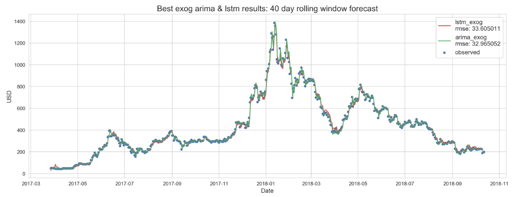

# Ethereum Price Forecasting with Machine Learning
## An Application of Time Series Regression Models and Neural Networks
### Prepared by: Brian McGuckin
### Thinkful Data Science Program: Final Capstone

## Project Summary
### 1. Data
- Ethereum (ETH) time series: daily close
- Data access: use APIs to get current price information
  - Cryptocurrency data: cryptocompare.com
  - Economic data: fred.stlouisfed.org
  - Cleaning/preprocessing:
    - Convert dates to datetime objects, set datetime index
    - Indices not traded/calculated for weekends/holidays: forward fill previous value until trade activity resumed
    - Address missingness for coins depending on time series start dates

### 2. EDA
- Stationarity: first degree differenced
- Structural breaks
  - Changepoint detection using combination of PELT & FBProphet
  - Size of rolling window set to median regime length (40 days)

### 3. Time Series Forecasting
**ARIMA**
- ACF/PACF
  - Results indicated 0 < AR/MA component < 1
  - ARIMA orders to model (p,d,q): (0,1,0), (1,1,0), (0,1,1)
  - ARIMA Results

(p,d,q)|RMSE
-------|---------
(0,1,0)|33 .122005
(1,1,0)|33.853124
(0,1,1)|33.983999
- Lowest RMSE: ARIMA(0,1,0)

**LSTM**
- Model configuration
  - Single LSTM layer and a Dense output layer
    - Performance did not improve from configs adding to neural net depth (stacked LSTM layers, dropouts, additional dense layers, etc)
    - Hyperparameters tuned with hyperopt: optimizer, learning rate, units, activation function, vector bias
- LSTM Results

Optimizer|RMSE     
---------|---------
RMSprop|34.654522
Adam|34.940433
Adamax|34.568555
Adagrad|34.307214
Adadelta|39.469572
- Lowest RMSE: Adagrad (learning rate tuned with TPE algorithm)

### 4. Exogenous Variables
- The following exogenous data was collected to potentially include as features for price forecasting
  - Ethereum trading data: OHLCV
  - Other Cryptocurrency prices: BTC, XRP, EOS, LTC, XLM, XMR
  - Other Economic Indicators: VIXCLS, TWEXB, EFFR
- Granger causality tests used to determine which to train models with
  - ETH close price Granger caused (one way) by: ETH Volume, XRP, LTC, XMR

**Results**

- ARIMA(0,1,0)
  - RMSE: 32.965052
  - Improved using ETH Volume
- LSTM (Adagrad)
  - RMSE:33.605011
  - Improved using XRP
